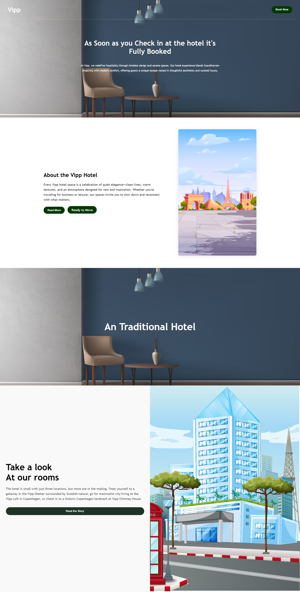

# Incapp - Assignment 10th

This is the **10th Assignment Project** from **Incapp Institute** ,
Created as part of the Frontend Development Training. 
The Assignment Demonstrates Practical use of **HTML** and **CSS** to Create a Visually Appealing and Responsive Layout.

## Features

- Fully Responsive Layout
- Use of modern CSS Styling
- Clean and Semantic HTML Structure
- Beginner-friendly and Well-Organized Code

## Tech Stack

**Client -** HTML5 & CSS3  
**Server -** None (Static Site)

## Screenshots

Below is a Preview of **Assignment 10th** , Showcasing the Layout and Styling Implemented using pure HTML and CSS. 
The Design focuses on Clean Structure , Responsiveness and Modern Styling.

